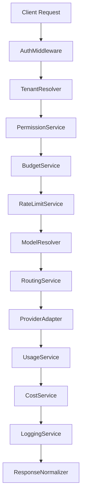

# WhiteGator AI Gateway API Documentation

## Overview

The WhiteGator AI Gateway provides a high-performance, enterprise-ready, OpenAI-compatible API interface for routing LLM requests across multiple backend providers (OpenAI, Anthropic, Gemini, Groq, OpenRouter, Azure OpenAI, Ollama, and Custom providers).

**Base Gateway URL**:
```text
https://api.whitegator.ai/v1
```
(Local Development: `http://localhost:8000/v1`)

---

## 14-Step Execution Pipeline

Every incoming gateway request passes through the following architecture pipeline:



---

## Endpoints

### 1. Chat Completions
`POST /v1/chat/completions`

**Headers**:
- `Authorization: Bearer wg_live_<secret_key>`
- `Content-Type: application/json`

**Request Body**:
```json
{
  "model": "whitegator-smart",
  "messages": [
    {
      "role": "user",
      "content": "Explain quantum computing in simple terms."
    }
  ],
  "temperature": 0.7,
  "max_tokens": 500,
  "stream": false
}
```

**Response**:
```json
{
  "id": "chatcmpl-req_1a2b3c4d5e6f",
  "object": "chat.completion",
  "created": 1700000000,
  "model": "whitegator-smart",
  "choices": [
    {
      "index": 0,
      "message": {
        "role": "assistant",
        "content": "Quantum computing processes information using quantum bits (qubits)..."
      },
      "finish_reason": "stop"
    }
  ],
  "usage": {
    "prompt_tokens": 15,
    "completion_tokens": 42,
    "total_tokens": 57
  }
}
```

---

### 2. Standard Responses Endpoint
`POST /v1/responses`

Accepts standard OpenAI-formatted payloads and returns completion objects.

---

### 3. Embeddings
`POST /v1/embeddings`

**Request Body**:
```json
{
  "model": "text-embedding-3-small",
  "input": "The quick brown fox jumps over the lazy dog"
}
```

---

### 4. List Available Models
`GET /v1/models`

Returns all enabled models and dynamic model aliases from the database catalog.

---

## Model Aliases

Model aliases resolve dynamically from database configuration (`ModelCatalog`):

| Alias | Description | Default Resolved Model |
| :--- | :--- | :--- |
| `whitegator-fast` | High speed, cost-optimized model | `gpt-4o-mini` |
| `whitegator-smart` | High reasoning capacity model | `gpt-4o` |
| `whitegator-code` | Code generation specialist | `claude-3-5-sonnet` |
| `whitegator-cheap` | Low-cost high-throughput model | `gemini-1.5-flash` |

---

## Virtual API Key Management & Scoping

Virtual API keys (`wg_live_...`) support fine-grained restrictions and limits:

- **Permissions**: Restrict allowed `models`, `endpoints`, `projects`, `organizations`.
- **Limits**: `RPM` (Requests per minute), `TPM` (Tokens per minute), `daily_budget`, `monthly_budget`, `max_request_size`.

### Key Operations (`/api/v1/keys`):
- `POST /api/v1/keys`: Create key (secret revealed ONLY ONCE)
- `GET /api/v1/keys`: List active keys
- `GET /api/v1/keys/{id}`: Inspect key details
- `POST /api/v1/keys/{id}/revoke`: Revoke key
- `POST /api/v1/keys/{id}/rotate`: Rotate key (issues new secret)
- `GET /api/v1/keys/{id}/usage`: Retrieve real-time usage metrics

---

## Structured Gateway Errors

| HTTP Code | Error Type | Trigger Cause |
| :--- | :--- | :--- |
| `401` | `unauthorized` | Invalid, missing, revoked, or expired API key |
| `403` | `forbidden` | Model or endpoint permission restricted for key |
| `404` | `not_found` | Model or alias not found in catalog |
| `429` | `rate_limit_exceeded` | RPM, TPM, or budget limit exceeded |
| `500` | `gateway_error` | Internal server error in WhiteGator API |
| `502` | `provider_error` | Upstream LLM provider HTTP failure |
| `503` | `provider_unavailable` | No healthy active deployment available |

---

## Cost Calculation Engine

Request cost is calculated per request using real-time database rates:

$$\text{Request Cost (USD)} = \left( \frac{\text{Input Tokens}}{1,000,000} \times \text{Input Rate per 1M} \right) + \left( \frac{\text{Output Tokens}}{1,000,000} \times \text{Output Rate per 1M} \right)$$

---

## Real-time Telemetry & Dashboard APIs

- `GET /dashboard/usage`: Filterable request logs & token throughput
- `GET /dashboard/costs`: Spend aggregations (today, yesterday, 7-day, 30-day, current month)
- `GET /dashboard/analytics`: Traffic distributions by provider, model, project, team, and key
